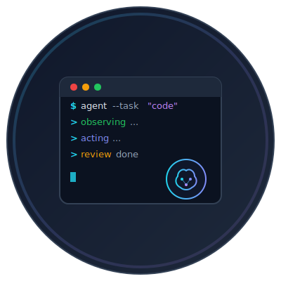

# Simple Agent

<p align="center">
  
</p>

Simple Agent is an interactive general-purpose AI agent that runs locally on your computer, capable of executing software engineering tasks by taking direct action on your filesystem.

## Features

- **Tool Use**: The agent can interact with your system using a set of tools:
  - `bash`: Execute shell commands to explore the project, read files, run tests, and manage the codebase.
  - `ask_user`: Request clarification or input from the user when needed.
- **Multiple LLM Providers**: Supports Ollama, OpenRouter, and OpenCode Go.
- **Interactive Loop**: A real-time CLI interface with a "thinking" indicator and tool-call logging.
- **System Prompting**: Uses a dedicated system prompt to ensure the agent observes the environment before making assumptions.

## Project Structure

- `main.go`: Entry point of the application, initializes the agent and registers tools.
- `agent/`: Core logic for managing the LLM conversation, tool registration, and execution loops.
- `tools/`: Implementations of the available tools (`bash` and `ask_user`).
- `SYSTEM_PROMPT.md`: The system instructions that define the agent's behavior and goals.

## Getting Started

### Prerequisites

- Go (Golang) installed.
- At least one LLM provider configured (see below).

### Configuration

Configuration is stored in `~/.simple-agent/config.json`. You can set your model and provider credentials there.

Example `config.json`:

```json
{
  "model": "openrouter/anthropic/claude-3.5-sonnet",
  "providers": {
    "openrouter": {
      "api_key": "sk-or-v1-..."
    },
    "opencode": {
      "api_key": "sk-...",
      "base_url": "https://api.opencode.ai/v1"
    },
    "ollama": {
      "host": "http://localhost:11434",
      "api_key": ""
    }
  }
}
```

Provider settings are read from `config.json` first, then fall back to environment variables.

### Supported Providers

| Provider | Model Prefix | Environment Variables | Config Fields |
|----------|-------------|----------------------|---------------|
| **Ollama** (default) | `ollama/<model>` or just `<model>` | `OLLAMA_HOST`, `OLLAMA_API_KEY`, `OLLAMA_MODEL` | `host`, `api_key` |
| **OpenRouter** | `openrouter/<model>` | `OPENROUTER_API_KEY` | `api_key`, `base_url` |
| **OpenCode Go** | `opencode/<model>` | `OPENCODE_API_KEY`, `OPENCODE_BASE_URL` | `api_key`, `base_url` |

### Running the Agent

```bash
go run main.go
```

Switch models at runtime with the `/model <name>` command.

## How it Works

The agent follows an **Observe → Act → Review** cycle:
1. **Observe**: When asked about the project, it uses the `bash` tool to explore files and code.
2. **Act**: It performs the requested task (e.g., editing code, creating files).
3. **Review**: It verifies its changes by running build commands or tests before finalizing the response.
